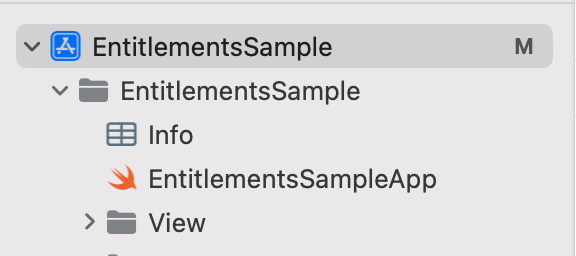
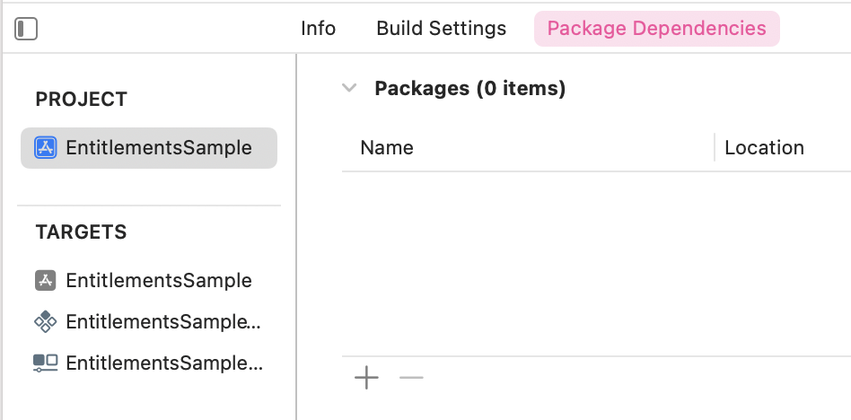
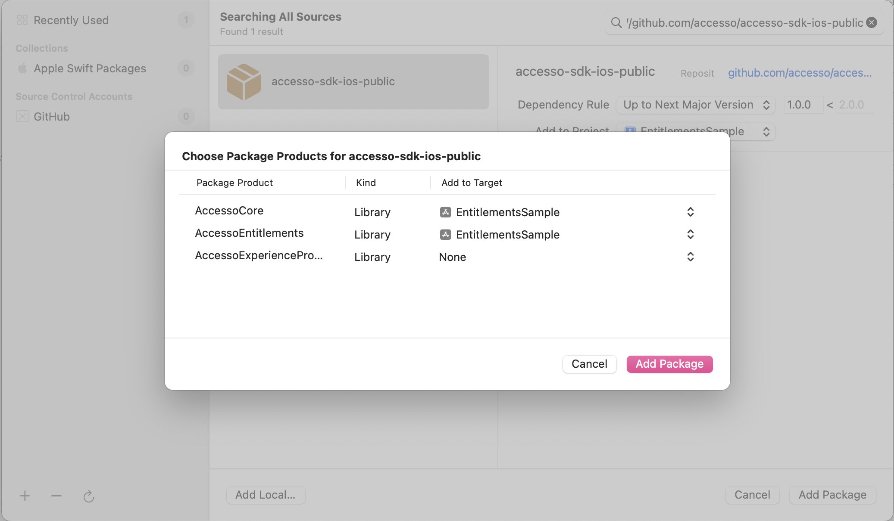

# AccessoSDKiOS Package

The AccessoSDKiOS package provides access to the Accesso XCFrameworks, simplifying the integration of various functionalities into your iOS applications.

## Libraries Included

| Library                    | Usage Requirement  | Description
| -------------------------- | ------------------ |----------------------------------------
| AccessoCore                | Required           | Provides core functionality for the Accesso SDK.
| AccessoExperiencePromoter  | Optional           | Enables integration with the Experience Promoter feature.
| AccessoEntitlements        | Optional           | Manages entitlements and permissions within your application.
| AccessoQueueing            | Optional           | Offers virtual queueing and retrieves a list of attractions and ride data. 

**NOTE:** AccessoCore is a required package and must be added for any framework to function

## Installation

### Using Swift Package Manager
To seamlessly integrate the AccessoSDKiOS package into your Xcode project using Swift Package Manager, follow these steps:

1. Open your project in Xcode.



2. Select your project's target.
3. Navigate to the `Package Dependencies` tab.
4. Click the "+" button to add a new package dependency.



5. Enter the URL of this repository: `https://github.com/accesso/accesso-sdk-ios-public`
6. Choose the package version and frameworks you want to use.
7. Ensure you add the selected framework to your app's main target.
8. Click "Add Package" and complete the installation.



### Manual Installation
Alternatively, you can manually add the package dependency to your `Package.swift` file
```swift
dependencies: [
    .package(url: "https://github.com/accesso/accesso-sdk-ios-public", from: "1.0.0"),
]
```

## Usage
Once you've added the package dependency, you can import the required libraries into your Swift code
```swift
import AccessoCore
import AccessoExperiencePromoter
import AccessoEntitlements
import AccessoQueueing
```

## Documentation
In the following documentation, you'll find user guides and tutorials for each library:

[Accesso Core Documentation](https://accessodevelopmentkit.com/docs/ios/1.0.0-dev.14/accessocore/documentation/accessocore/)

[Accesso Experience Promoter Documentation](https://accessodevelopmentkit.com/docs/ios/1.0.0-dev.14/accessoexperiencepromoter/documentation/accessoexperiencepromoter/)

[Accesso Entitlements Documentation](https://accessodevelopmentkit.com/docs/ios/1.0.0-dev.14/accessoentitlements/documentation/accessoentitlements/)

[Accesso Queueing Documentation](https://accessodevelopmentkit.com/docs/ios/1.0.0-dev.14/accessoqueueing/documentation/accessoqueueing/)

For more information, visit the [Accesso Development Kit website](https://accessodevelopmentkit.com/).

## License
2023 © accesso™
**All Rights Reserved**


